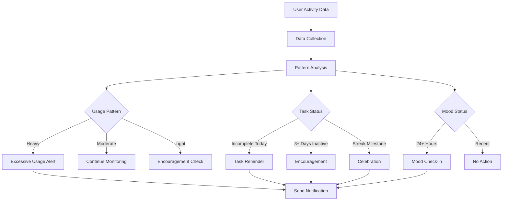

# Reclaim Flutter - Push Notification System Documentation

## Overview
This document provides a comprehensive technical overview of the behavior-based push notification system implemented in the Reclaim Flutter application. The system analyzes user habits, usage patterns, and activities to send intelligent, contextual notifications that support addiction recovery and personal growth.

## Table of Contents
1. [System Architecture](#system-architecture)
2. [Core Components](#core-components)
3. [Notification Types](#notification-types)
4. [Behavior Analysis Engine](#behavior-analysis-engine)
5. [Implementation Details](#implementation-details)
6. [Usage Instructions](#usage-instructions)
7. [Future Enhancements](#future-enhancements)

---

## System Architecture

### High-Level Overview
```
┌─────────────────────────────────────────────────────────────────┐
│                        User Interactions                         │
│    (Task Completion, Mood Tracking, Screen Time, etc.)          │
└────────────────────┬────────────────────────────────────────────┘
                     │
                     ▼
┌─────────────────────────────────────────────────────────────────┐
│             User Activity Tracking Service                       │
│  • Session Management                                            │
│  • Screen View Tracking                                          │
│  • Usage Pattern Analysis                                        │
└────────────────────┬────────────────────────────────────────────┘
                     │
                     ▼
┌─────────────────────────────────────────────────────────────────┐
│            Habit Detection & Analysis Engine                     │
│  • Task Completion Patterns                                      │
│  • Mood Check-in Frequency                                       │
│  • Excessive Usage Detection                                     │
│  • Inactivity Detection                                          │
│  • Streak Milestones                                             │
└────────────────────┬────────────────────────────────────────────┘
                     │
                     ▼
┌─────────────────────────────────────────────────────────────────┐
│              Notification Trigger Engine                         │
│  • User Settings Validation                                      │
│  • Do Not Disturb Rules                                          │
│  • Priority Assignment                                           │
│  • Scheduling Logic                                              │
└────────────────────┬────────────────────────────────────────────┘
                     │
                     ▼
┌─────────────────────────────────────────────────────────────────┐
│          Local & Cloud Notification Delivery                     │
│  • Flutter Local Notifications (Scheduled)                       │
│  • Firebase Cloud Messaging (Push)                               │
│  • Platform-Specific Handlers (iOS/Android)                      │
└─────────────────────────────────────────────────────────────────┘
```

### Technology Stack
- **Framework**: Flutter 3.5.4+
- **State Management**: Provider (ChangeNotifier pattern)
- **Backend**: Firebase (Firestore, Cloud Messaging)
- **Local Notifications**: flutter_local_notifications ^18.0.1
- **Time Zone Support**: timezone ^0.9.4
- **Cloud Messaging**: firebase_messaging ^15.1.3

---

## Core Components

### 1. NotificationModel (`lib/models/notification_model.dart`)
Defines the data structure for notifications.

**Key Classes**:
- `NotificationModel`: Represents a single notification with metadata
- `NotificationSettings`: User preferences for notification behavior
- `NotificationType`: Enum defining notification categories
- `NotificationPriority`: Importance levels (low, medium, high, critical)

**Fields**:
```dart
class NotificationModel {
  final String? id;
  final String uid;              // User ID
  final String title;
  final String body;
  final NotificationType type;
  final NotificationPriority priority;
  final Map<String, dynamic>? data;  // Custom payload
  final DateTime scheduledAt;
  final DateTime? sentAt;
  final bool read;
  final DateTime createdAt;
}
```

### 2. NotificationService (`lib/services/notification_service.dart`)
Handles local notification delivery using flutter_local_notifications.

**Key Methods**:
- `initialize()`: Sets up notification channels and handlers
- `requestPermissions()`: Requests notification permissions from user
- `showInstantNotification()`: Sends immediate notification
- `scheduleNotification()`: Schedules notification for future delivery
- `scheduleDailyNotification()`: Sets up recurring daily reminders
- `cancelNotification()`: Cancels specific notification
- `cancelAll()`: Clears all pending notifications

**Notification Channels**:
- `instant_channel`: Immediate notifications
- `scheduled_channel`: Scheduled reminders and alerts
- `daily_channel`: Daily task reminders

### 3. UserActivityService (`lib/services/user_activity_service.dart`)
Tracks user behavior and app usage patterns.

**Tracked Metrics**:
- Session start/end times
- Session duration
- Screen view count
- Per-screen time spent
- Average session duration (7-day rolling)
- Session frequency

**Usage Pattern Classification**:
- **Light**: < 15 minutes average session
- **Moderate**: 15-30 minutes average session
- **Heavy**: > 30 minutes average session

**Key Methods**:
- `startSession()`: Begin tracking user session
- `endSession()`: Save session data to Firestore
- `trackScreenView()`: Log screen navigation
- `detectExcessiveUsage()`: Identify problematic usage patterns
- `getUsageInsights()`: Analyze historical usage data

### 4. HabitDetectionService (`lib/services/habit_detection_service.dart`)
Analyzes user habits and triggers contextual notifications.

**Analysis Categories**:

#### a) Task Management
- Incomplete tasks created today
- Days since last task completion
- Current streak calculation
- Task completion patterns

#### b) Mood Tracking
- Days since last mood check-in
- Mood pattern analysis

#### c) Usage Patterns
- Excessive app usage detection
- Screen time trends
- Session frequency

#### d) Engagement Metrics
- User inactivity detection
- Streak milestones
- Achievement progress

**Trigger Logic**:
```dart
// Excessive Usage Alert: Triggered when:
- Average session duration > 30 minutes (last 3 days)
- More than 10 sessions per day

// Task Reminder: Triggered when:
- User has incomplete tasks created today
- Daily reminder setting enabled

// Mood Check-in: Triggered when:
- More than 24 hours since last mood entry
- Mood check-in setting enabled

// Encouragement: Triggered when:
- 3+ days since last task completion
- User showing signs of disengagement

// Streak Milestone: Triggered when:
- Streak is multiple of 7 (weekly milestones)
- Milestone notifications enabled
```

### 5. NotificationProvider (`lib/providers/notification_provider.dart`)
State management for notifications using Provider pattern.

**Responsibilities**:
- Load/save user notification settings
- Manage notification list state
- Track unread notification count
- Coordinate habit analysis execution
- Schedule daily reminders based on user preferences

**Key Methods**:
- `initialize()`: Set up notification service
- `loadSettings()`: Fetch user preferences from Firestore
- `saveSettings()`: Update user preferences and reschedule notifications
- `loadNotifications()`: Retrieve notification history
- `markAsRead()`: Update read status
- `runHabitAnalysis()`: Trigger behavior-based analysis

### 6. NotificationSettingsScreen (`lib/screens/notification_settings_screen.dart`)
User interface for managing notification preferences.

**Features**:
- Master notification toggle
- Per-category notification settings
- Daily reminder time picker
- Do Not Disturb schedule
- Manual habit analysis trigger
- Real-time settings synchronization

---

## Notification Types

### 1. Reminder (`NotificationType.reminder`)
**Purpose**: Daily task completion reminders  
**Priority**: Medium  
**Trigger**: Scheduled at user-defined time (default 9:00 AM)  
**Example**: "📋 Don't Forget Your Tasks - You have 3 tasks waiting for you today."

### 2. Encouragement (`NotificationType.encouragement`)
**Purpose**: Motivational messages during inactivity  
**Priority**: Low  
**Trigger**: 3+ days without task completion  
**Example**: "💪 Stay Strong - You've got this! Every small step counts."

### 3. Check-In (`NotificationType.checkIn`)
**Purpose**: Mood tracking prompts  
**Priority**: Medium  
**Trigger**: 24+ hours since last mood entry  
**Example**: "💭 How Are You Feeling? - Take a moment to track your mood."

### 4. Milestone (`NotificationType.milestone`)
**Purpose**: Celebrate achievements and streaks  
**Priority**: High  
**Trigger**: Streak multiples of 7 (7, 14, 21, etc.)  
**Example**: "🎉 Streak Milestone! - You've maintained a 14-day streak!"

### 5. Warning (`NotificationType.warning`)
**Purpose**: Excessive usage alerts  
**Priority**: High  
**Trigger**: Heavy usage pattern detected (>30 min average)  
**Example**: "⏰ Screen Time Alert - You've been spending 45 minutes per session recently."

### 6. Recovery (`NotificationType.recovery`)
**Purpose**: Relapse risk alerts  
**Priority**: Critical  
**Trigger**: Risk assessment algorithms (future implementation)  
**Example**: "🆘 Support Available - Reach out to your support network."

### 7. Streak (`NotificationType.streak`)
**Purpose**: Daily streak reminders  
**Priority**: Medium  
**Trigger**: User has active streak, tasks incomplete today  
**Example**: "🔥 Keep Your Streak Alive - Complete today's tasks!"

---

## Behavior Analysis Engine

### Analysis Workflow



### Statistical Thresholds

| Metric | Threshold | Action |
|--------|-----------|--------|
| Average Session Duration | > 30 minutes | Excessive Usage Alert |
| Daily Session Count | > 10 sessions | Excessive Usage Alert |
| Days Since Last Task | ≥ 3 days | Encouragement Notification |
| Days Since Mood Check | > 1 day | Mood Check-in Prompt |
| Incomplete Tasks Today | > 0 | Task Reminder |
| Streak Milestone | Multiple of 7 | Celebration Notification |

### Data Collection Points

**Firestore Collections**:
```
users/{uid}/
  ├── activity/
  │   └── {sessionId}
  │       ├── sessionStart: Timestamp
  │       ├── sessionEnd: Timestamp
  │       ├── duration: int (seconds)
  │       ├── screenViews: int
  │       └── screenDurations: Map<String, int>
  │
  ├── tasks/
  │   └── {taskId}
  │       ├── completed: bool
  │       ├── completedAt: Timestamp?
  │       └── createdAt: Timestamp
  │
  ├── moods/
  │   └── {moodId}
  │       ├── rating: int (1-5)
  │       └── createdAt: Timestamp
  │
  ├── notifications/
  │   └── {notificationId}
  │       ├── title: String
  │       ├── body: String
  │       ├── type: String
  │       ├── read: bool
  │       └── sentAt: Timestamp
  │
  └── settings/
      └── notifications
          ├── enabled: bool
          ├── dailyReminders: bool
          ├── moodCheckIns: bool
          ├── milestones: bool
          ├── encouragement: bool
          ├── riskAlerts: bool
          ├── reminderTime: String
          └── doNotDisturbEnabled: bool
```

---

## Implementation Details

### Initialization Sequence

1. **App Startup** (`main.dart`)
```dart
await Firebase.initializeApp();
await NotificationService().initialize();
runApp(const ReclaimApp());
```

2. **Provider Setup** (`app.dart`)
```dart
MultiProvider(
  providers: [
    ChangeNotifierProvider(create: (_) => NotificationProvider()),
    // ... other providers
  ],
  // ...
)
```

3. **User Login Flow**
```dart
// After successful authentication
final notificationProvider = context.read<NotificationProvider>();
await notificationProvider.loadSettings(user.uid);
await notificationProvider.runHabitAnalysis(user.uid);
```

### Activity Tracking Integration

**In Dashboard/Screen Widgets**:
```dart
@override
void initState() {
  super.initState();
  UserActivityService().trackScreenView('DashboardScreen');
}
```

**App Lifecycle Management**:
```dart
class _MyAppState extends State<MyApp> with WidgetsBindingObserver {
  @override
  void initState() {
    super.initState();
    WidgetsBinding.instance.addObserver(this);
    UserActivityService().startSession();
  }

  @override
  void didChangeAppLifecycleState(AppLifecycleState state) {
    if (state == AppLifecycleState.paused) {
      final uid = context.read<UserProvider>().user?.uid;
      if (uid != null) {
        UserActivityService().endSession(uid);
      }
    }
  }
}
```

### Notification Scheduling

**Daily Reminders**:
```dart
// User sets reminder time to 9:00 AM
await notificationService.scheduleDailyNotification(
  id: 1,
  title: '📋 Daily Task Reminder',
  body: 'Complete your tasks today!',
  hour: 9,
  minute: 0,
);
```

**Behavior-Based Notifications**:
```dart
// Triggered by habit analysis
final notification = NotificationModel(
  uid: uid,
  title: '⏰ Screen Time Alert',
  body: 'You've been spending 45 minutes per session recently.',
  type: NotificationType.warning,
  priority: NotificationPriority.high,
  scheduledAt: DateTime.now(),
  createdAt: DateTime.now(),
);

await notificationService.showInstantNotification(notification);
```

### Permission Handling

**Android** (`android/app/src/main/AndroidManifest.xml`):
```xml
<uses-permission android:name="android.permission.POST_NOTIFICATIONS"/>
<uses-permission android:name="android.permission.SCHEDULE_EXACT_ALARM"/>
```

**iOS** (`ios/Runner/Info.plist`):
```xml
<key>UIBackgroundModes</key>
<array>
  <string>remote-notification</string>
</array>
```

**Runtime Permissions**:
```dart
final granted = await notificationService.requestPermissions();
if (!granted) {
  // Show explanation dialog
}
```

---

## Usage Instructions

### For Users

1. **Access Settings**
   - Navigate to Dashboard
   - Tap the bell icon (🔔) in the app bar
   - Adjust notification preferences

2. **Configure Reminders**
   - Enable "Daily Reminders"
   - Set preferred reminder time
   - Select active days (Mon-Sun)

3. **Set Do Not Disturb**
   - Enable "Do Not Disturb"
   - Set start time (e.g., 10:00 PM)
   - Set end time (e.g., 7:00 AM)

4. **Test Notifications**
   - Scroll to bottom of settings
   - Tap "Run Habit Analysis Now"
   - Check for triggered notifications

### For Developers

1. **Add New Notification Type**
```dart
// In notification_model.dart
enum NotificationType {
  reminder,
  encouragement,
  // ... existing types
  customType,  // Add new type
}

// In habit_detection_service.dart
Future<void> _sendCustomNotification(String uid) async {
  final notification = NotificationModel(
    uid: uid,
    title: 'Custom Title',
    body: 'Custom message',
    type: NotificationType.customType,
    priority: NotificationPriority.medium,
    scheduledAt: DateTime.now(),
    createdAt: DateTime.now(),
    data: {'custom_key': 'custom_value'},
  );

  await _notificationService.showInstantNotification(notification);
  await _saveNotification(notification);
}
```

2. **Add New Trigger Condition**
```dart
// In habit_detection_service.dart analyzeAndNotify()
if (settings.customSetting && _customCondition(taskStats)) {
  await _sendCustomNotification(uid);
}
```

3. **Extend Activity Tracking**
```dart
// In user_activity_service.dart
void trackCustomEvent(String eventName, Map<String, dynamic> data) {
  // Log custom event to Firestore
}
```

---

## Future Enhancements

### Phase 1: Advanced Analytics
- **ML-Based Risk Prediction**: Train models on user behavior to predict relapse risk
- **Sentiment Analysis**: Analyze mood journal entries for early warning signs
- **Anomaly Detection**: Identify unusual usage patterns automatically

### Phase 2: Personalization
- **Adaptive Scheduling**: Learn optimal notification times per user
- **Content Personalization**: Customize message content based on user preferences
- **Smart Frequency Control**: Reduce notification frequency for engaged users

### Phase 3: Social Features
- **Buddy System**: Notify users when their accountability partner needs support
- **Group Challenges**: Send notifications for group milestones
- **Community Events**: Announce support group meetings, webinars

### Phase 4: Integration
- **Wearable Support**: Integrate with smartwatches for gentle reminders
- **Calendar Sync**: Coordinate notifications with user's calendar
- **Third-Party Apps**: Connect with meditation apps, fitness trackers

### Phase 5: Backend Optimization
- **Cloud Functions**: Move heavy analysis to Firebase Functions
- **Real-Time Triggers**: Use Firestore triggers for instant notifications
- **A/B Testing**: Test notification effectiveness and optimize

---

## Troubleshooting

### Notifications Not Showing
1. Check system notification permissions
2. Verify app has permission in OS settings
3. Ensure notification settings are enabled in-app
4. Check Do Not Disturb schedule

### Analysis Not Running
1. Verify Firebase connection
2. Check Firestore security rules
3. Ensure user activity data exists
4. Review debug logs for errors

### Permissions Denied
1. Uninstall and reinstall app
2. Manually enable in OS settings:
   - Android: Settings > Apps > Reclaim > Notifications
   - iOS: Settings > Reclaim > Notifications

---

## Performance Considerations

- **Battery Optimization**: Local notifications use minimal battery
- **Network Usage**: Analysis runs only when triggered (not continuous polling)
- **Data Storage**: 30-day activity retention to manage storage
- **Firestore Costs**: Optimized queries to reduce read operations

---

## Security & Privacy

- All user data stored in Firebase with proper authentication
- Notification content never contains sensitive information
- Activity tracking is opt-in (can be disabled)
- Data encrypted in transit and at rest
- No third-party data sharing

---

## License
This notification system is part of the Reclaim Flutter application. All rights reserved.

## Contact
For technical support or feature requests, please contact the development team.

---

**Last Updated**: December 13, 2025  
**Version**: 1.0.0  
**Author**: Reclaim Development Team
